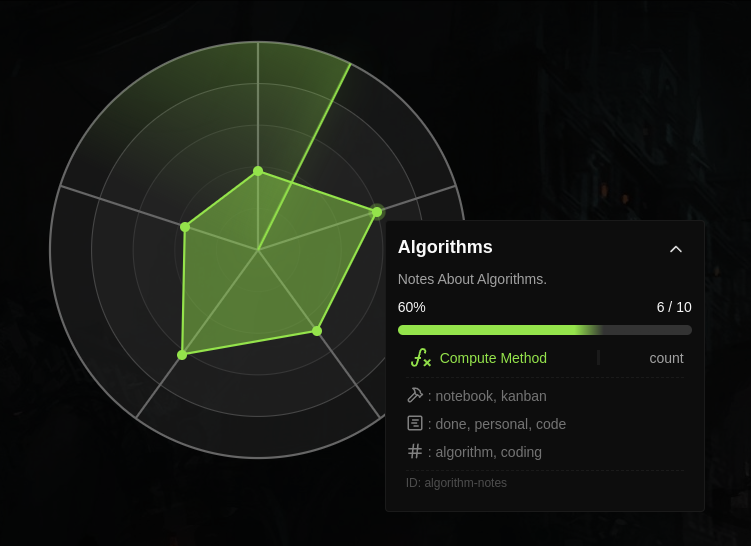
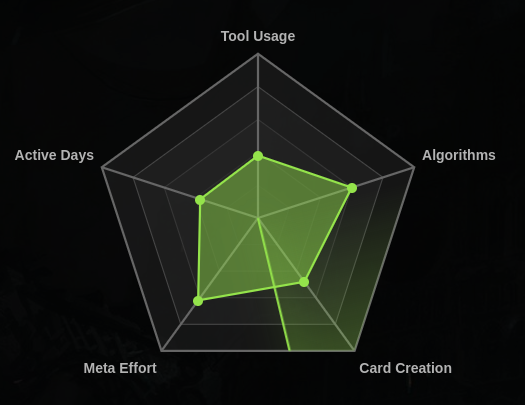

<h1 align="center" style="font-size: 50px">
  RAARITE
</h1>

  
  

**Radarite** lets you create customizable radar charts based on your data in Hollow.  
It turns your entries into metrics so you can track progress, habits, or anything else that matters.

## Installation

You can install Radarite directly from Hollow's settings.  

##  How It Works

Each radar chart is built using **metrics** that you define.

For each metric, you choose:

- **Name** – What the chart should call it
- **Compute Method** – How to calculate the value:
  - \`count\`: Count matching entries
  - \`sum\`: Add up a number from your data
  - \`average\`: Get the average of a number
- **Meta Key** – *(only for \`sum\` and \`average\`)* the key of the number field in your entries
- **Filtering** – Optional filters:
  - Tags (e.g. \`#work\`, \`#ideas\`)
  - Tools (e.g. Notes, Tasks)
  - Cards (specific card names)

You can have as many metrics as you want — and they'll show up as axes on the radar chart.

Made for people who like to visualize their data.
